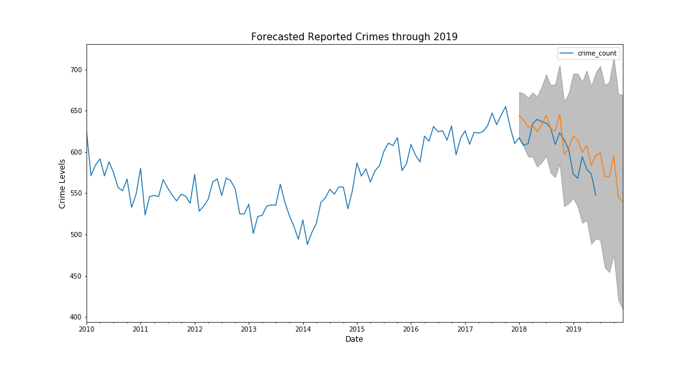

# Los Angeles Crime Forecasting

**Authors**: [David Bruce](mailto:david.bruce14@gmail.com), [Sidney Kung](mailto:sidneyjkung@gmail.com), [Lhamu Tsering](mailto:boutlhamu@gmail.com)

## Overview
This summer (2020) saw a historic rise of demonstrations across the United States calling to 'Defund the Police.' Los Angeles Mayor, Eric Garcetti, reversed the trend of increasing police spending for the first time in years by reducing the Los Angeles Police Department (LAPD) budget by $150 million ([NY Times](https://www.nytimes.com/interactive/2020/06/12/upshot/cities-grew-safer-police-budgets-kept-growing.html)). Using the most recent data on crime made available by the City of Los Angeles ([data.lacity.org](https://data.lacity.org/Public-Safety/Crime-Data-from-2010-to-2019/63jg-8b9z)) from January 2010 - June 2019, we used univariate time series modeling to forecast reported crime in Los Angeles to determine recent crime trends in LA. Working with AR, MA, ARMA, and SARIMA models we determined the best fit with the lowest AIC score. Then evaluated our best model, a SARIMA model, using RMSE and AIC. The final model had an RMSE of 24.66. 

## Business Problem

Los Angeles has the third largest police department in the country, with jurisdiction over almost 4 million people. The [People’s Budget LA](https://peoplesbudgetla.com/) and other community movements have worked to push local government to search for alternative social service solutions to public safety. We set out to justify this divestment with time series predicting and forecasting. Through additional analysis of the data we identify which areas and populations in LA have been hit the hardest by crime in the last 9 years, so that budget resources can be reallocated to social services in those high-impact communities.

## Data & Methods

This dataset is the [LA Crime & Arrest Data](https://www.kaggle.com/cityofLA/los-angeles-crime-arrest-data) from Kaggle. It reflects incidents of crime in Los Angeles dating from 2010 to mid-2019. The data is transcribed from original crime reports that may contain inaccuracies.

This was a univariate time series problem, predicting the monthly average crime count for each year. Time series model iterations included AR, ARMA and SARIMA algorithms. We compared the models against each other using the AIC score, and evaluated the final model with RMSE. The RMSE simply measures how accurate predictions are.  We predicted data through 2019, because short-term predictions can aid immediate decisions for the business context.

## Business Questions
1. How much has crime fluctuated in the last 10 years?

The average monthly crime in the period between 2010 and 2018 ranges between 530 crimes per month to 630 crimes per months. We can also see that 2017 saw the highest average number of crimes reported, while 2013 saw the lowest average number of crimes reported in LA.

2. What areas in LA have the highest crime rate?

The top 5 areas where most of the crimes in LA have occured among the 21 geographic areas is 77th Street, Southwest, North Hollywood, Pacific, and Southeast.

3. What are the top 3 vulnerable demographics in LA?

For all the crimes reported between 2010 and June of 2019, at 34%, victims of Latinx descent account for the highest number of victims of crimes in that period. White victims account for 24% and Black victims account for 16% of all crime victims in that period.

Looking at the top 3 vulnerable demographics in LA, Black and Latinx communities has most suffered in the highest crime occuring areas of 77th Street and Southeast. This could also be that there are lesser White people living in these two areas. White victims are highest in the North Hollywood, Pacific areas. Again, this could be because these areas have higher white population. Similarly, areas such as Mission, Newton, Rampart, Foothill and Hollenbeck have a higher number of Latinx victims than the other descents.

## Final Model Performance

## Recommendations
Our recommendations stem primarily from our explorative data analysis. The forecasts our model predicted predicts a slight decrease in crime for 2019.

1. Based on the limited forecasting power of our univariate model, we recommend compiling more historical data to build stronger predictive power

2. Funding formerly allocated to the LAPD should be redistributed to social service solutions to public safety problems in the highlighted areas (77th Street, Southwest, and North Hollywood).

3. Communities of color, namely Black and Latinx, makeup larger portions of the victims in these high-crime areas and should receive small business loans and other community-based incentives to help revitalize these areas.

## Next Steps
- With more time we would acquire more historical data to help make stronger predictions and forecasts further into the future. 
- The addition of exogenous variables from census data would also add some complexity to our univariate model that could help us to diagnose underlying issues with crime more directly. 
- Using a SARIMAX model or experimenting with Facebook Prophet would be of interest, and using incoming data to evaluate our model's forecasting performance.

## Repository Contents
- `EDA`: Folding contains exploratory data analysis notebooks
- `data`: Folder contains data used in repository
- `modeling`: Folder contains different stages of modeling
- `src`: Contains .py files
- `visualizations`: Folder containing images used in repository
- `.gitignore`: Contains untracked files including the original dataset
- `final_notebook.ipynb`: Final notebook with EDA analysis and modeling process
