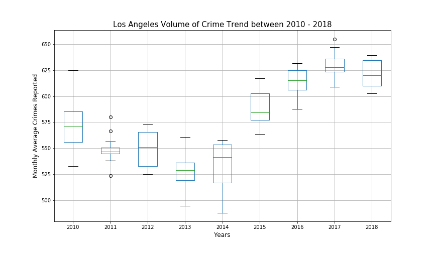
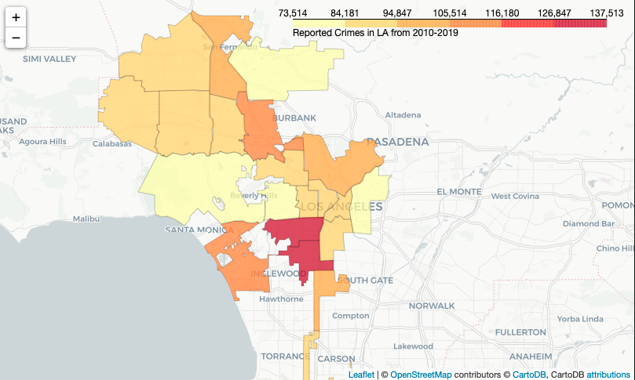

# Los Angeles Crime Forecasting

**Authors**: [David Bruce](mailto:david.bruce14@gmail.com), [Sidney Kung](mailto:sidneyjkung@gmail.com), [Lhamu Tsering](mailto:boutlhamu@gmail.com)

## Overview
This summer (2020) saw a historic rise of demonstrations across the United States calling to 'Defund the Police.' Los Angeles Mayor, Eric Garcetti, reversed the trend of increasing police spending for the first time in years by reducing the Los Angeles Police Department (LAPD) budget by $150 million ([NY Times](https://www.nytimes.com/interactive/2020/06/12/upshot/cities-grew-safer-police-budgets-kept-growing.html)). Using the most recent data on crime made available by the City of Los Angeles ([data.lacity.org](https://data.lacity.org/Public-Safety/Crime-Data-from-2010-to-2019/63jg-8b9z)) from January 2018 - June 2019, we used univariate time series modeling to forecast reported crime in Los Angeles to determine recent crime trends in LA. Working with AR, MA, ARMA, and SARIMA models we determined the best fit with the lowest AIC score, and evaluated our best model (a SARIMA model) using RMSE. The final model had an RMSE of ___. 

## Business Problem

Los Angeles has the third largest police department in the country, with jurisdiction over almost 4 million people. The [People’s Budget LA](https://peoplesbudgetla.com/) and other community movements have worked to push local government to search for alternative social service solutions to public safety. With the ... we set out to justify this divestment with time series predicting and forecasting. Through additional analysis of the data we identify which areas and populations in LA have been hit the hardest by crime in the last 9 years, so that budget resources can be reallocated to social services in those high-impact communities.

## Data & Methods

## Final Model Performance

## Next Steps

## Repository Contents
- `final_notebook.ipynb`: Final notebook containing complete anlysis and modeling
- `EDA`: 
- `modeling`: 
- `.gitignore`: Contains untracked files including the original dataset
- `data`: Folder containing data using in repository
- `visualisations`: Folder containing images used in repository
